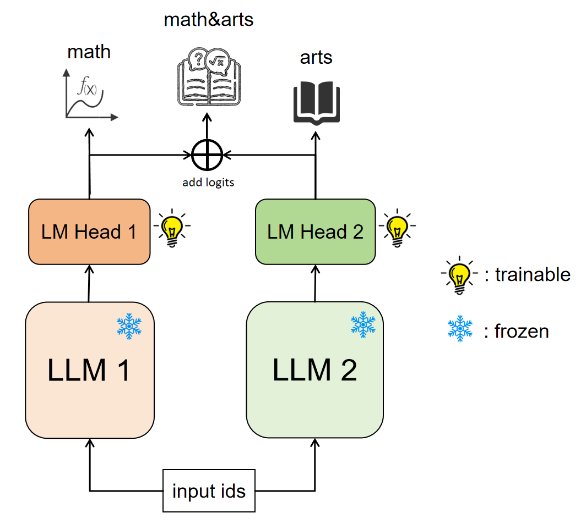

# LLM simple combining

* 不同的LLM具有不同的优势，例如数学类模型数学能力明显更强，而一般的聊天模型则更擅长文科类问题。
* 过去研究已经提出了多种多模型融合的方法，但是这些方法通常需要引入新的结构或较多的训练。
* 因此，我们提出一种简单的方法，来聚合不同模型的优势。

## Method

* 将多个LLM输出logits直接相加，作为最终logits。
* 训练时，每个LLM仅有lm_head可训练，其它部分冻结。
* 联合的LLM可以是任意结构或大小的，但要求tokenizer相同。



## Experiment
* 我们将[deepseek-math-7b](https://huggingface.co/deepseek-ai/deepseek-math-7b-instruct)（擅长数学与推理）作为LLM1， 
[DeepSeek-V2-Lite-Chat](https://huggingface.co/deepseek-ai/DeepSeek-V2-Lite-Chat)（擅长文科，知识丰富）作为LLM2，
将两者输出的logits相加，作为最终logits，进行训练。训练时仅训练各自的lm_head。

* 训练数据为中英各1000条通用指令微调数据，训练耗时仅10分钟（loss还远未收敛）。

* [训练后权重下载](https://huggingface.co/yuyijiong/deepseek-math-chat-lite)。下载权重后即可运行 ```test.py``` 进行测试。

# Limitation
* 联合后模型的数学能力可能略弱于deepseek-math-7b。
* 运行时LLM1和LLM2是先后运算的（并行会要求更大显存），所以运行时间约等于两者之和。

## TODO
- [ ] 联合更多模型，例如3个以上模型联合，联合coder模型、多模态模型。
- [ ] 优化训练数据，增加数据量和多样性。
- [ ] 使用MMLU、GSM8K等数据集进行全面的模型能力评估。

## QA examples

理科问题1：9.11和9.9哪个更大？（正确答案：9.9更大）

```angular2html
deepseek-math-7b: 
9.9更大。


DeepSeek-V2-Lite-Chat:
9.11和9.9都是整数，它们之间的大小比较取决于它们在数轴上的位置。
在十进制系统中，一个数字的每一位都代表不同的数量级。
在这个问题中，9.11和9.9都是以9开头，但是9.11的第一个非零数字是1，而9.9的第一个非零数字也是1。
这意味着9.11的值大于9.9。 因此，9.11比9.9大。


无训练，logits直接相加:
9.11和9.9是两个十进制数，我们可以通过比较它们的小数部分来判断哪个更大。
在这个例子中，9.11和9.9的小数部分都是0.1，但是9.11的小数部分比9.9的小数部分多0.01。
因此，9.11比9.9大。所以，9.11和9.9中，9.11更大。


联合训练lm head:
9.11和9.9都是小数，其中9.11的整数部分是9，小数部分是0.11；9.9的整数部分是9，小数部分是0.9。 
比较小数部分，0.11比0.9小，因此9.11比9.9小。 
所以，9.9比9.11更大。
```

理科问题2：慢车车长25米，车速每秒15米，快车车长125米，车速每秒25米，慢车在前面行驶，快车从后面追上来。那么，快车从追上慢车车尾到完全超过慢车需要多长时间？（正确答案：15秒）
    
```angular2html
deepseek-math-7b: 
首先，我们需要知道快车要完全超过慢车，需要行驶的距离是两车的长度之和，即 $25\text{米（慢车）} + 125\text{米（快车）} = 150\text{米}$。
然后，我们需要知道快车和慢车的相对速度，即快车的速度减去慢车的速度，即 $25\text{米/秒（快车）} - 15\text{米/秒（慢车）} = 10\text{米/秒}$。
最后，我们用总的需要行驶的距离除以相对速度，就可以得到快车从追上慢车车尾到完全超过慢车需要的时间，即 $\frac{150\text{米}}{10\text{米/秒}} = 15\text{秒}$。
所以，快车从追上慢车车尾到完全超过慢车需要 $\boxed{15}$ 秒。


DeepSeek-V2-Lite-Chat:
首先，我们需要找出快车追上慢车车尾所需的时间。这可以通过将快车和慢车的相对速度相加，然后除以他们的速度差来得到。
快车和慢车的相对速度是快车的速度加上慢车的速度，即25米/秒 + 15米/秒 = 40米/秒。
快车追上慢车车尾所需的时间是慢车的长度除以相对速度，即25米 / 40米/秒 = 0.625秒。
然后，我们需要找出快车完全超过慢车所需的时间。这可以通过将快车的长度除以相对速度，然后加上快车追上慢车车尾所需的时间来得到。
快车的长度是125米，所以快车完全超过慢车所需的时间是125米 / 40米/秒 + 0.625秒 = 3.125秒。
所以，快车从追上慢车车尾到完全超过慢车需要的时间是$\boxed{3.125}$秒。


无训练，logits直接相加:
 首先，我们需要知道快车要完全超过慢车，需要行驶的距离是多少。这个距离等于慢车的长度加上快车自身的长度，即 $25 + 125 = 150$ 米。
然后，我们需要知道快车和慢车的相对速度是多少。因为快车和慢车是同向行驶，所以它们的相对速度等于快车的速度减去慢车的速度，即 $25 - 15 = 10$ 米/秒。
最后，我们可以通过相对速度和需要行驶的距离来计算出快车从追上慢车车尾到完全超过慢车需要的时间。这个时间等于需要行驶的距离除以相对速度，即 $150 / 10 = 15$ 秒。
所以，快车从追上慢车车尾到完全超过慢车需要 $\boxed{15}$ 秒。


联合训练lm head:
 ## 问题分解
我们将这个问题分解为以下几个小问题：
1. 计算快车追上慢车车尾所需的时间。
2. 计算快车完全超过慢车所需的时间。
## 解决问题
现在让我们逐步解答这些问题：
### 问题1：快车追上慢车车尾所需的时间是多少？
快车要追上慢车车尾，就需要走过的路程等于慢车走过的路程加上慢车的车长。由于快车和慢车的速度不同，所以他们走过的路程可以用速度乘以时间来表示。因此，我们可以得到以下等式：
$$v_{快车} \times t_{追上} = v_{慢车} \times t_{追上} + L_{慢车}$$
其中，$v_{快车}$ 是快车的速度，$v_{慢车}$ 是慢车的速度，$t_{追上}$ 是快车追上慢车车尾所需的时间，$L_{慢车}$ 是慢车的车长。将已知的数值代入等式，我们得到：
$$25 \times t_{追上} = 15 \times t_{追上} + 25$$
解这个等式，我们得到：
$$t_{追上} = \frac{25}{25-15} = \frac{25}{10} = 2.5 \text{秒}$$
### 问题2：快车完全超过慢车所需的时间是多少？
快车要完全超过慢车，就需要走过的路程等于慢车走过的路程加上慢车的车长加上快车的车长。因此，我们可以得到以下等式：
$$v_{快车} \times t_{超过} = v_{慢车} \times t_{超过} + L_{慢车} + L_{快车}$$
其中，$t_{超过}$ 是快车完全超过慢车所需的时间，$L_{快车}$ 是快车的车长。将已知的数值代入等式，我们得到：
$$25 \times t_{超过} = 15 \times t_{超过} + 25 + 125$$
解这个等式，我们得到：
$$t_{超过} = \frac{25+125}{25-15} = \frac{150}{10} = 15 \text{秒}$$
## 解题答案
所以，快车从追上慢车车尾到完全超过慢车需要的时间是 $\boxed{15}$ 秒。
```

文科问题1：写一首七言绝句，赞美春天的景色。（正确答案：应符合七言绝句格式）

```angular2html
deepseek-math-7b:
春天来了，万物复苏，大地一片生机勃勃。
小草从地下探出头来，嫩绿嫩绿的，像给大地铺上了一层绿色的地毯。
花儿们也竞相开放，红的、黄的、蓝的、紫的，五颜六色，美丽极了


DeepSeek-V2-Lite-Chat:
《七绝·春望》 
二月风光似画屏， 
山峦树影醉风声。 
春光有意怜芳草， 
绿意轻随一水东。


无训练，logits直接相加:
春光如画，春光如诗，春光如歌。
春天的景致，美妙无比，让人陶醉。花儿绽放，鸟儿歌唱，到处充满生机。
春雨细细，春风柔柔，春光无限好。


联合训练lm head:
春日风光无限好， 
草长莺飞百鸟鸣。 
花红柳绿春意浓， 
万物复苏生机勃。
```

文科问题2：欧洲有多少个国家？（正确答案：44）

```angular2html
deepseek-math-7b:
欧洲有50个国家。

DeepSeek-V2-Lite-Chat:
截至我知识更新的时间点（2023年），欧洲共有44个国家，包括以下这些：...

无训练，logits直接相加:
欧洲共有44个国家，包括：...

联合训练lm head:
截至2019年，欧洲共有44个国家。
```